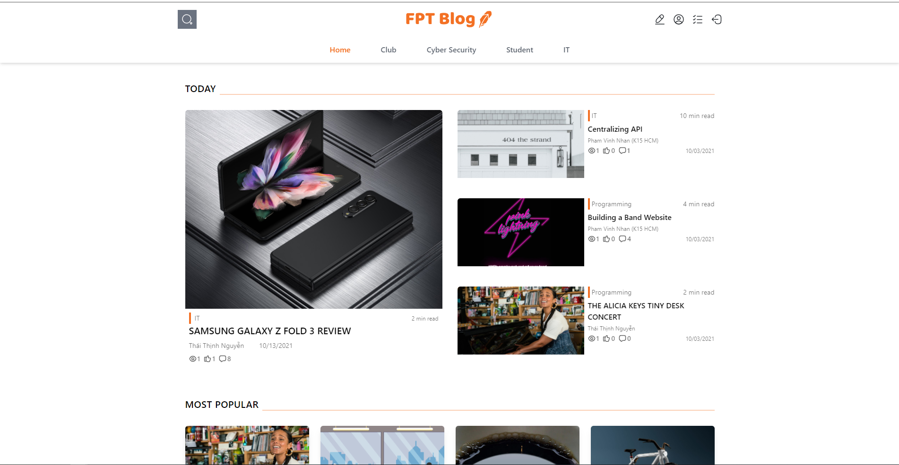
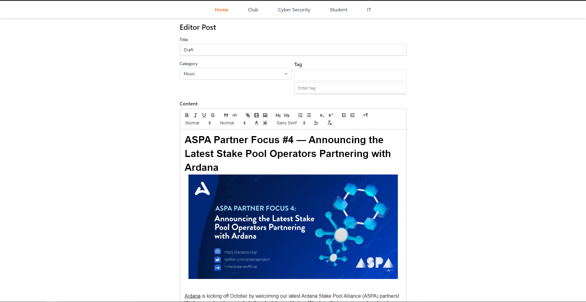
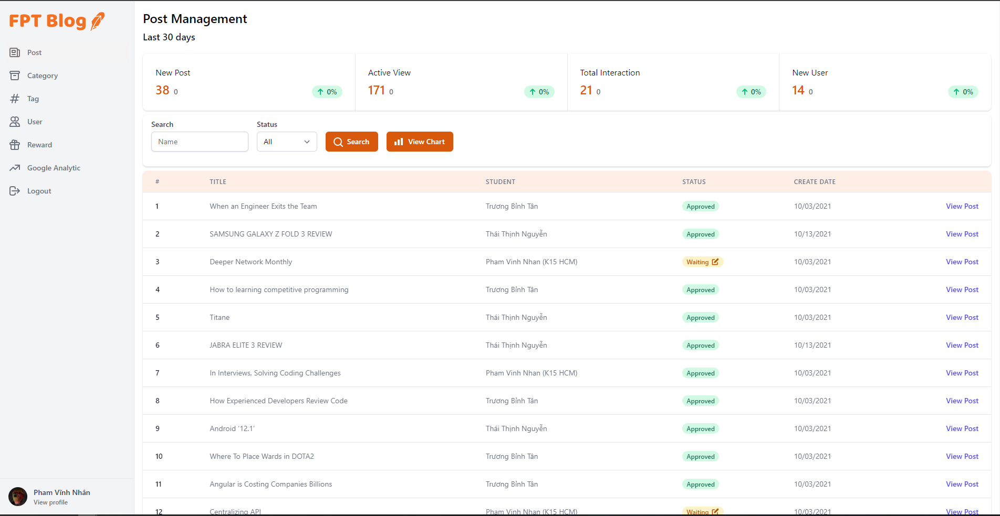

## [Live Demo](https://fptblog.vinhnhan.com) - [Live Document](https://heaty566.github.io/fpt-blog-doc/document.pdf)

## Case Study

Trong kỷ nguyên số, nguồn thông tin và dữ liệu trên Internet được xem như một tài nguyên tri thức vô cùng phong phú. Con người có thể dễ dàng tìm kiếm thông tin,
dữ liệu thông qua nguồn tài nguyên này. Tuy nhiên, với biển dữ liệu lớn này, SV đang gặp khó khăn trong việc chọn lọc nội dung, chủ đề cấp thiết nhất cho ngành học,
môn học của mình tại trường ĐH. Bên cạnh đó, những SV đã trích lọc được những kinh nghiệm, kiến thức thông qua các môn học,
các chủ đề lại không có nền tảng để phổ biến đến đúng đối tượng-là các sinh viên trong trường.

Hệ thống ra đời nhằm hỗ trợ các bạn sinh viên trường F, là những writer, reader theo các chuyên mục, chuyên ngành hay môn học nào đó.
Nơi đây, các bạn writer có thể viết bài, đăng bài; các bạn reader được cập nhật các nội dung có chất lượng, gần gũi với các vấn đề học tập,
cá nhân mình đang gặp phải. Ngoài ra, các mentor/lecturer tham gia với vai trò kiểm duyệt nội dung bài. Các bài blog có nội dung hay,
thiết thực, được quan tâm nhiều, được phản hồi nhiều sẽ được trao các phần thưởng danh dự tương ứng.

## Feature by role

- Common Role
     - Login and register account
     - Update user information
     - Change password
     - Write new post
     - Like or dislike posts
     - Follow or unfollow users
     - View profile other users
     - Write comment
     - Check notification
     - Save or unsave posts
     - Search and view posts
- FPT Student Role
     - Write new post
- FPT Lecture Role
     - Manage and view chart tags
     - Manage and view chart users
     - Manage and view chart posts
     - Manage and view chart rewards
     - Manage and view chart categorys
     - Manage notification
     - View analytic
     - Block particular user, or category

## Technology

- Frontend
     - cshtml - Server Side Rendering
     - Tailwind - Style
     - Javascript(TS) + Webpack
- Backend
     - ASP.NET - Server Core
     - Entity Framework - Object–relational mapping
     - SQL Server 2019 - Database
- Design Pattern
     - Service-Repository pattern
     - Dependency injection pattern
     - SOLID Principles
- Deployment
     - Docker - Container Management
     - Nginx - Loader Balancer
     - Github Action - CI/CD
     - Digital Ocean - VPS

## Team Member

- Phạm Vĩnh Nhân | Full-Stack - Leader
     - Gmail: heaty566@gmail.com
     - Linkedin: https://www.linkedin.com/in/heaty566
     - Github: https://github.com/Heaty566
- Nguyễn Thái Thịnh | Backend
     - Gmail: thaithinhbanzai79@gmail.com
     - Linkedin: https://www.linkedin.com/in/thaithinhfgc
     - Github: https://github.com/thaithinhfgc
- Cao Chí Hải | Backend
     - Gmail: haicao2805@gmail.com
     - Linkedin: https://www.linkedin.com/in/cao-chi-hai
     - Github: https://github.com/haicao2805
- Trương Bỉnh Tân | Backend + Frontend
     - Gmail: tantruong2303@gmail.com
     - Linkedin: https://linkedin.com/in/truongbinhtan
     - Github: https://github.com/tantruong2303
- Nguyễn Lương Hoàng Nam | Backend
     - Gmail: monkeynam208@gmail.com
     - Linkedin: https://linkedin.com/in/truongbinhtan
     - Github: https://www.linkedin.com/in/monkinam

## Special Thank For Supporting Us

- Nguyễn Quế Trân | UI - UX Designer
     - Facebook: https://www.facebook.com/profile.php?id=100034774181375
- Trương Thanh Duy | UI Designer
     - Facebook: https://www.facebook.com/trthduy

## Project Picture

### Home Page

### Post Editor

### Manager Page

### Login Page

### VPS Panel Management

## Bug Report

Feel free to create an issue request anytime we will check it out and fix it as soon as possible. Thank You So Much.

## © 2021 Mono Infinity - FPT University
